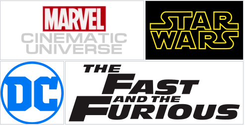
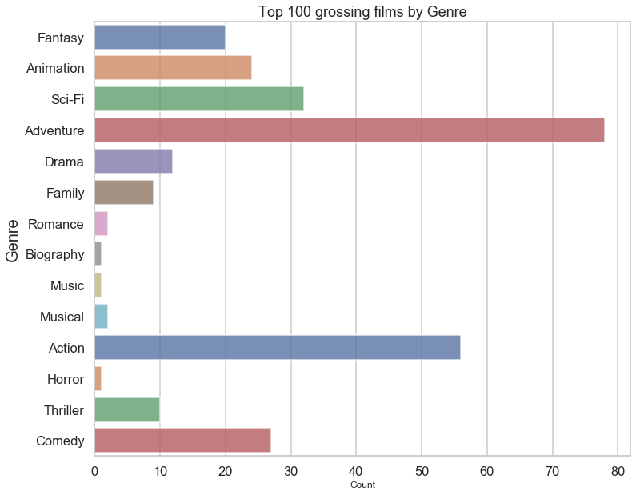
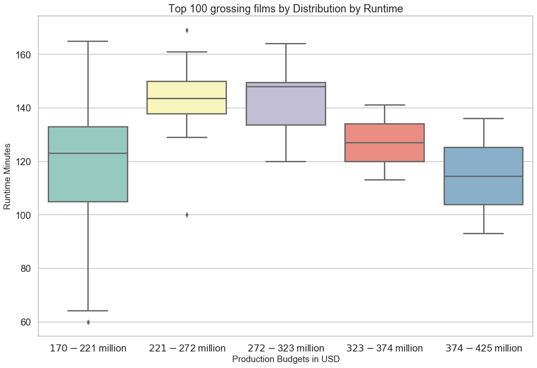
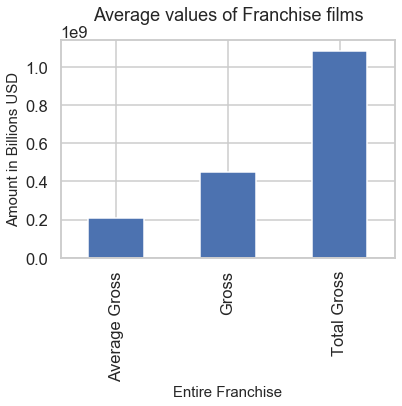
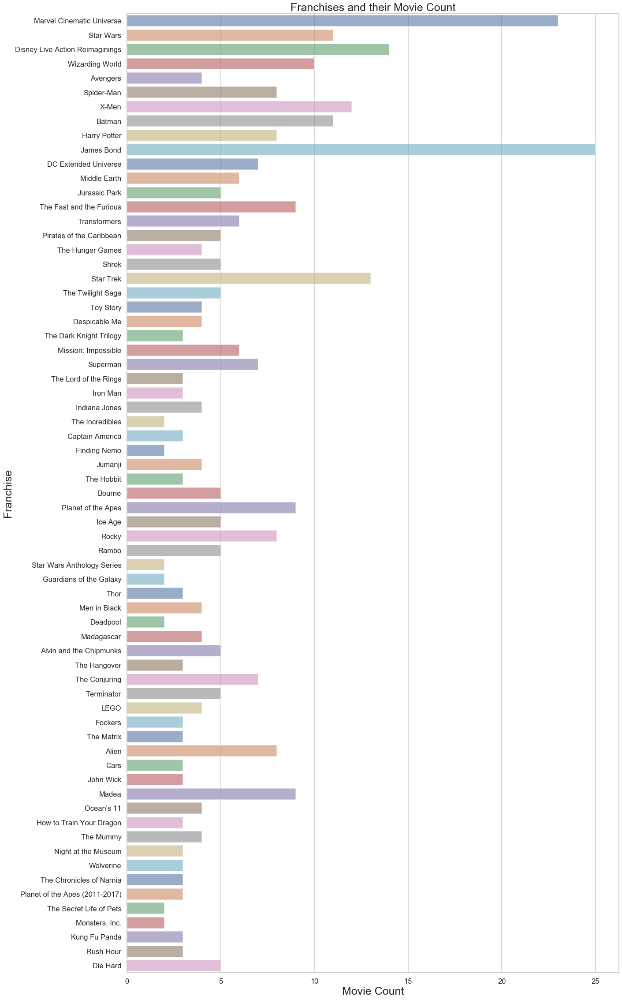
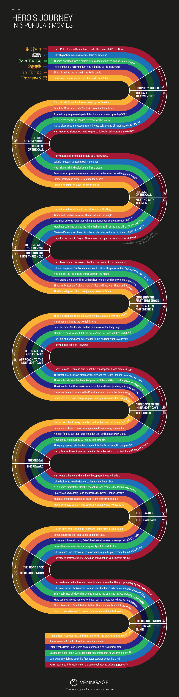
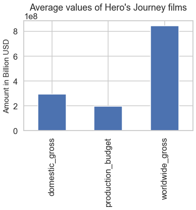
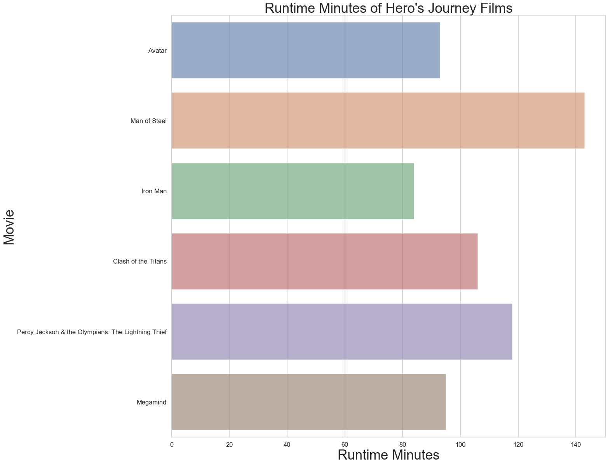
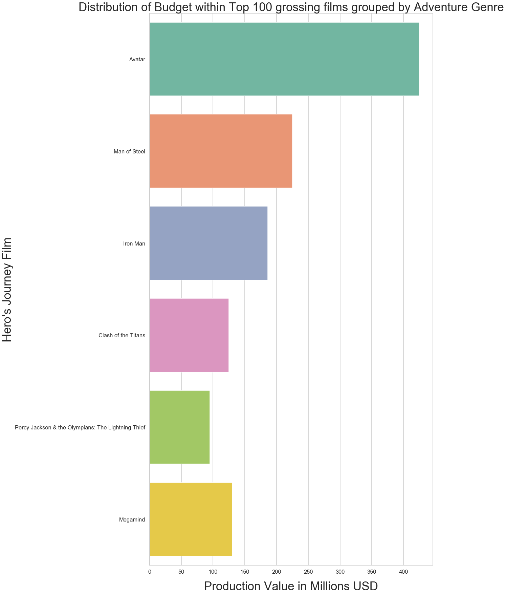

# Exploring Trends among Top Grossing Films

## Introduction

Microsoft is interested in creating a new movie studio, and has hired me to *help the company better understand the movie industry*. The key question Microsoft wants answered through data analysis is: 
What **type** of **films** are currently doing the **best** at the **box office**?
Upon answering this question, they would like me to translate these findings into **actionable insights** for the studio to use when deciding what films they should make.

## Objectives

The goals of this project are to answer three questions:

 - Q1: What trends exist among the 100 highest grossing films?
     * Find and express general trends among the highest grossing contemporary films.
 
 - Q2: Is there a correlation between Franchise Films and 100 highest grossing films?
     * Delve deeper into trends related to franchise films to find correlations among the top grossing films.
     
 - Q3: What is a key correlation among Franchise Plots?
     * Pinpoint an important pattern among successful franchise film storylines.
 

## Methodology

This project will take an in-depth look into data describing the film industry and its current trends. The process to make this exploration will be:

Import libraries & modules:

   - Gain access to code from other libraries and modules
   
Gather data & Read in dataframes:

   - Get access to the dataframes to be used

Clean Data:

  - Check for null values
  - Impute or drop null values
  - Check for duplicate values
  - Drop duplicates
  - Join dataframes where necessary
  
EDA for Question 1

   - Conduct feature engineering where necessary
   - Make visualizations
   - Assess for valuable correlations
   - Summarize findings
   
EDA for Question 2

  - Conduct feature engineering where necessary
  - Make visualizations
  - Assess for valuable correlations
  - Summarize findings
  
EDA for Question 3

  - Conduct feature engineering where necessary
  - Make visualizations
  - Assess for valuable correlations
  - Summarize findings
  
Conclusion & Recommendations

  - Conclude findings
  - Offer recommendations

## Import Libraries & Modules

The beginning of the project involves importing the libraries used throughout the project that do all the heavy lifting, these include:

- `Pandas`: a data analysis library we will use for its data structures and operations for manipulating numerical tables.
- `Numpy`: an essential library for scientific computing in python
- `Matplotlib`: a plotting library useful for making the graphs and visualizations we need.
- `Seaborn`: a data visualization library based on matplotlib to make graphs more visually appealing.
- `BeautifulSoup`: a library that is useful for pulling data out of `HTML` and `XML` files allowing us to navigate, search, and modify the parse tree of the web file.
- `Glob`: a module for generating lists of files, and will prove useful when reading in our dataframes.
- `OS`: a module which will enable us to use operating system dependent functionality.
- `Warnings` : a filter used to suppress certain warning messages created from the output of 'iffy' commands.

## Gather data & Read in dataframes

In order to help Microsoft better understand the film industry I needed data. After imports I read in a collection of dataframes that describe the current state of the film industry to glean actionable insights. I was initially provided with a zipped folder of several dataframes collected from the internet. Using pandas, I can accessed the files using the `.read_csv()` method.

Film data used to answer these questions have been scraped from various websites including:

* Box Office Mojo
* IMDB
* Rotten Tomatoes
* TheMovieDB.org
* Wikipedia
* The-numbers
* Statista

## Clean Data

We have used several methods to clean multiple dataframes. We have used the `.info()` method and `.head()` method to view the structural shape of the dataframes including their structure and datatypes, as well as look into the dataframes themselves.

Furthermore we have used this information to make informed decisions about how to manage missing and duplicated data. We have taken advantage of `.value.sum()` chains to know if a dataframe had any missing or duplicated values. We then used `.dropna()` and `.drop_duplicates()` to delete missing and duplicated values from the dataframes.

We used `.fillna()` in conjunction with the `.median()` method to fill the missing values with the median value of a particular column of a dataframe.

We used the `.merge()` method to join dataframes with useful data on identical columns and used the `.replace()` methods to alter the values within columns. This enabled us to change datatypes of columns that were ill assigned.

# Q.1: What trends exist among the 100 highest grossing films?

For Q1 I searched for patterns that might exist among the top grossing films. I explore features through visualizations with matplotlib and seaborn to gain insights and recommendations.

## EDA for Q1

### Genre VIsualization

### Production Value Visualization

#### Code used to create production value range bins

    # Create a list of integers, including infinity defined by numpy.
    bins = [170000000, 221000000, 272000000, 323000000, 374000000, np.inf]
    # Create a name for the bins expressing the range for each bin.
    names = ['$170-$221 million', '$221-$272 million',
         '$272-$323 million', '$323-$374 million', '$374-$425 million']
    # Make a new categorical column names budget range, which is made of the 
    # segments from the production budget column, 
    df_prod_100['budget_range'] = pd.cut(
    #cut at the bin values and label with the names list.
    df_prod_100['production_budget'], bins=bins, labels=names)

### Runtime Visualization

## Q1 Insights, Recommendations, & Future Work

##### Insights

Upon inspection, and exploratory data analysis there would appear to be trends among the top 100 worldwide grossing films. The data shows that:

  - **Action** and **Adventure** films are among the most popular genre of films among the top grossing around the world.
  - A reasonable budget for production for a film expected to be in the top 100 grossing is between **170-221 million dollars**, with Action films costing **50 million dollars** more to make on average. The average worlwide gross of the top 100 films was roughly **750 million** dollars. 
  - A favorable runtime for a film belonging to the top 100 grossing worldwide is around **120 minutes**, with Action movies having an average **30 minute** longer length. There does **not appear to be a correlation between a film's gross and runtime**.

##### Recommendaion

* **Make an Action/Adventure film**
Create an Adventure or Action film with a **production budget between 171 and 221 million dollars**, if making specifically an **Action film increase budget by around 30 million dollars**. The film should have a **runtime of around 127 minutes**, in other words 2 hours. The **average worldwide gross of Action films is around 750 million dollars**.

##### Future Work

* Explore demographics on movie goers
* Utilize ratings data to find correlations among perceived quality of films

# Q.2 Is there a correlation between Franchise Films and 100 highest grossing films?

When taking a look at the list of top 100 grossing films, there seems to be a pattern not just among the genre, or budget, but also within the content. Many of these films are a part of a series, or have origins that are within the same fictional source. Here I explored the relationship between those films that are part of a franchise and the highest grossing films.

## EDA for Q2

### Top Franchise Visualization

### Franchise Age Visualization

### Franchise Movie Count Visualization

## Q2 Insights, Recommendations, & Future Work

##### Insights

Upon exploring the relationship between Franchise films and the top 100 grossing films, it is clear that there is a strong correlation. The **average gross of a franchise film was found to be around 200 million dollars**, while the **average gross of a franchise's best performing film was around 450 million dollars**. The **average gross of an entire franchise was 1.08 billion dollars**. 

Creating a franchise would allow Microsoft studios to create a collection of films, **releasing a film on average every 2-3 years**. Data has also shown that the Action and Adventure genre is popular among the most common franchise films.

##### Recommendation

* **Make a Film Franchise**
Use this Action/Adventure film to begin a franchise. This would enable to studio to make on average **one film every 2-3 years for 10 years**. An average franchise film **grosses 200 million dollars domestically**, while the gross of a franchise's **number one film is around 450 million dollars**. A franchise would on **average earn 1.08 billion dollars** for the company. 

Suggested franchises to make are based on **franchises Microsoft already owns** which can **easily fit the Action/Adventure film** genre such as the **Minecraft, Halo, and Forza franchises**. If Microsoft were successful in transferring the fanbases of these gaming franchises into the movie industry, the three franchises combined could add around **3.3 billion dollars worth of revenue into the company**.
For this project, your Jupyter Notebook should meet the following specifications:

##### Future Work

* Gather and analyze data on films that are analagous with Microsoft game franchises
* Use machine learning models such as sentiment analysis to find valuable insights from these films' scripts.

# Q.3 What is a key correlation among Franchise Plots?

With franchise films appearing to be among the most successful in the box office, it would prove valuable to **explore some common traits of franchise films** beyond the genre and budget. Here we can investigate some **commonalities between the storylines** of these blockbusters, and share these insights with the team at Microsoft to enable them to make one of the most successful franchises of all time.

When analyzing a franchise, the most important aspect is the fact that the storyline must be one of **depth**, an **epic** that allows for several installments to tell the story, and in many cases a space for continuation that allows the story to grow over the years. Using domain knowledge brings us to **The Hero's Journey**. In Joseph Campbell's most notable work, *The Hero With a Thousand Faces*, a theory is introduced of the hero archetype that has been told countless times across history, referred to as the monomyth, or One Myth. The Hero's journey is characterized by 10-12 steps:

## EDA for Q3

### Hero's Journey Gross Visualization

#### Code used to scrape Hero's Journey Data

    # Define the URL we ant to make a request to
    URL = 'https://www.imdb.com/list/ls055945505/'
    # Define the request
    response = requests.get(URL)
    # Convert response to a BeautifulSoup object
    soup = BeautifulSoup(response.text, 'html.parser')
    # View our soup object
    print(soup)

### Hero's Journey Runtime Visualization

### Hero's Journey Production Budget Visualization

## Q3 Insights, Recommendations, & Future Work

##### Insights

The data showed that there is a **strong correlation between franchise film storylines and the Hero's Journey** as it has been defined. I can see that a high percentage of franchise films utilize the Monomyth in order to create a plot with depth and epic that allows for several installments to tell the story, and in many cases a space for continuation that allows the story to grow over the years. 

I can see that the worldwide gross of this group is quite high, being about **845 million dollars**. The **average runtime of a Hero's Journey film is 104 minutes**, and the average production budget is **197 million dollars**. This may be one of the most profitable categories of film that we have explored. The monomyth also aligns with the most popular top grossing film genres Adventure and Action.

##### Recommendations 

* **Use The Hero's Journey Format**
The film franchise should follow the Hero's Journey format. This is a proven format among franchise films that allow the space and growth necessary to sustain a large collection of films. These films on **average gross 845 million dollars worldwide**, with an average production budget of **197 million dollars**. This format also lends itself to the Action and Adventure genre very well.

##### Future Works

* Gather more data on Monomyth films
* Reseach other trends found within the storylines of successful franchise films
